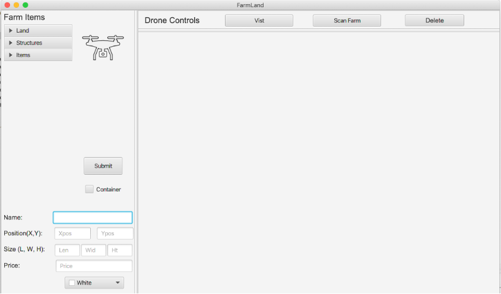
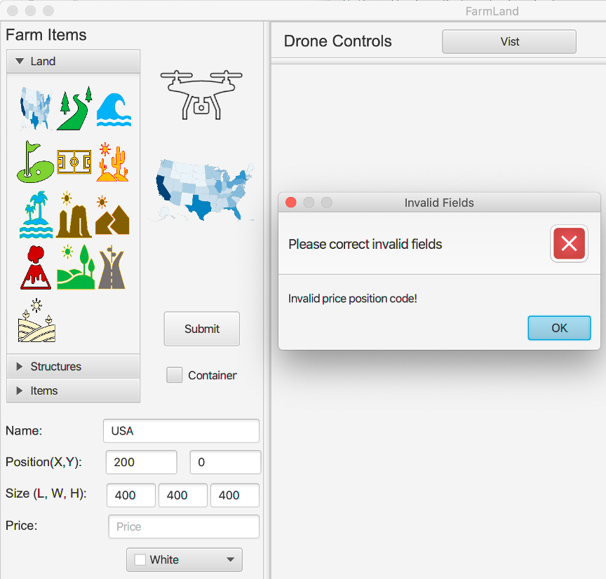
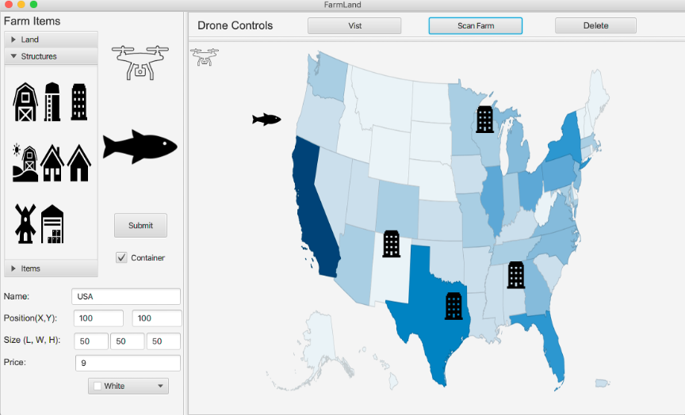

FarmLand
========

# Start
##### To run this program you must execute the MainApp.Java file located in ch.makery.address

# Instructions
1.    Scene - Stat by building a screen using the images located under the Farm Items menu. Images are optional. On click the image you selected will be enlarged in the window located under the drone. 
2.    Specifications - Once you have selected an image complete the specification and press submit. An error message will be displayed if the information you submitted does not meet the requirements. You must submit at least one object to activate the drone. We recommend that you complete the entire scene before activating the drone so that It does not travel behind your images (This will be fixed in the future). 
3.    Ready - The drone can be activated by pressing the drone image. You can delete an image from the FarmLand widow by clicking the image and pressing the delete button 

# Index
## Farm Items 
- **Land** – Intended as a background we recommend: Position (x,y) 100,0;  Size (L,W,H) 500,500,500. You can creative as you like. These can also be used as landmarks or containers.
- **Structure** – Adds buildings
- **Items** – More creative design images
    - **Animals** – lions, tigers, and bears OH MY
    - **Crops** – fruits and vegetables
    - **Equipment** – cars, trucks, and more
- **Drone Image** – Adds the active drone to the FarmLand main window
- **Name** – Names the component
- **Position(X,Y)** -  Positions the component in the main FarmLand window
- **Size (L,W,H)** – Resizes the component in the main FarmLand window
- **Price** – Prices the component
- **Color Box** – Adds a color to the component (this may change the image in the future)
